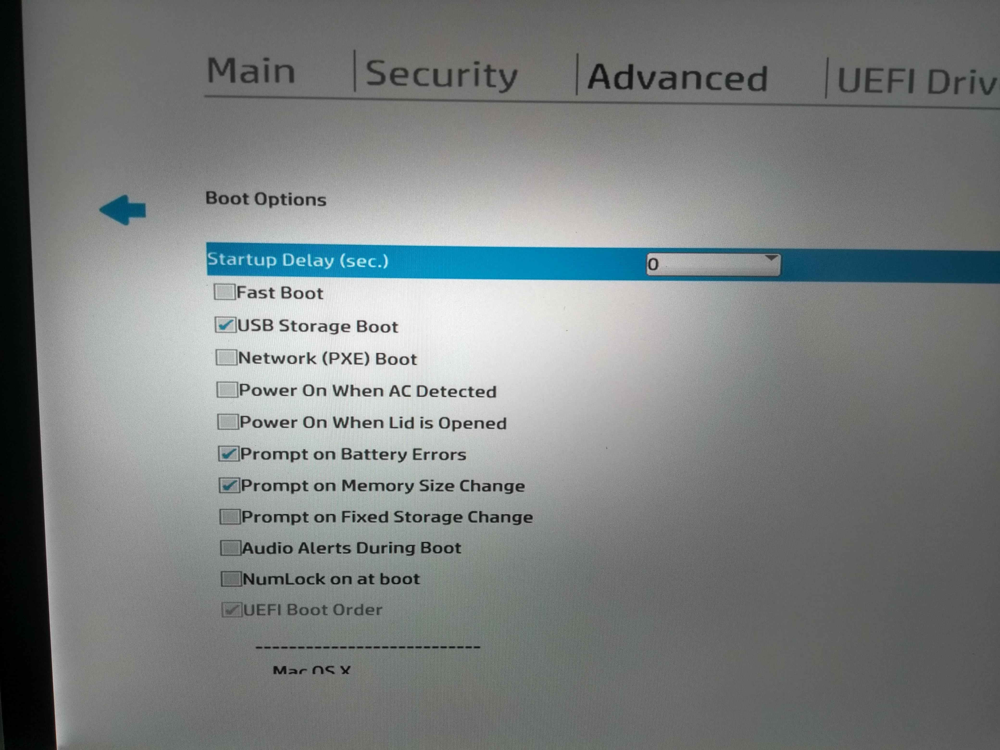
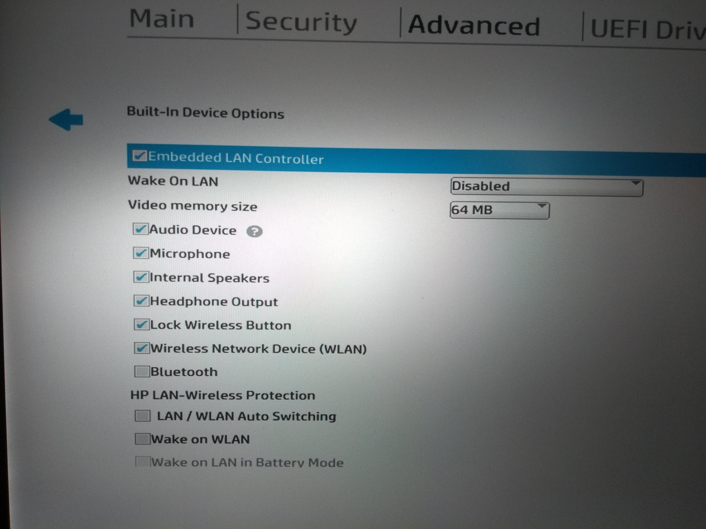
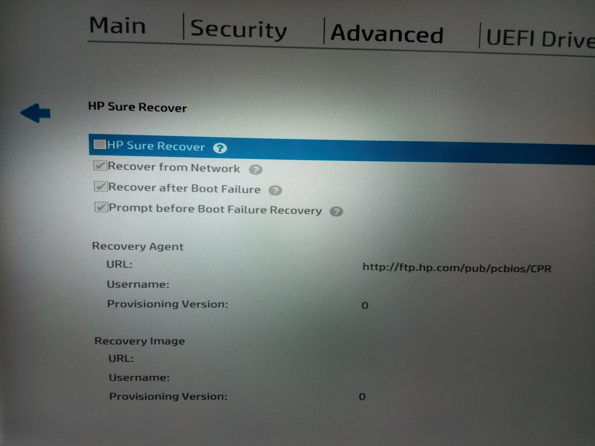
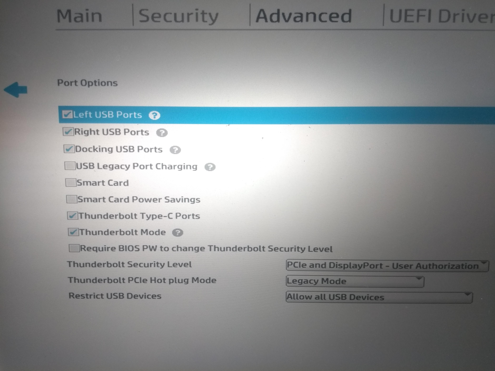
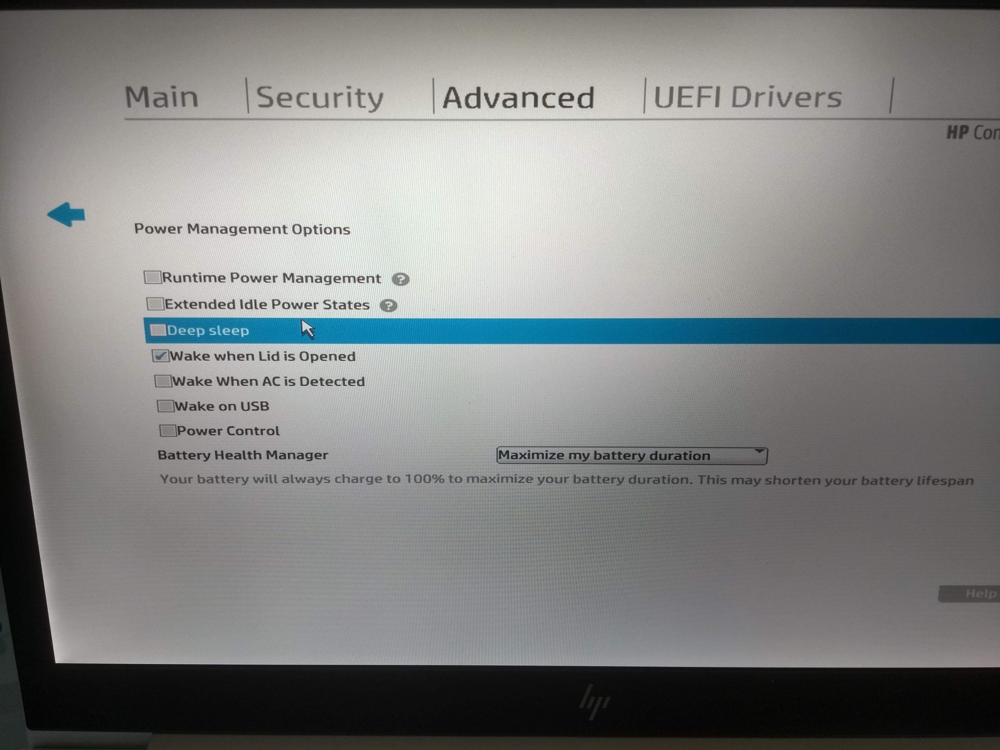
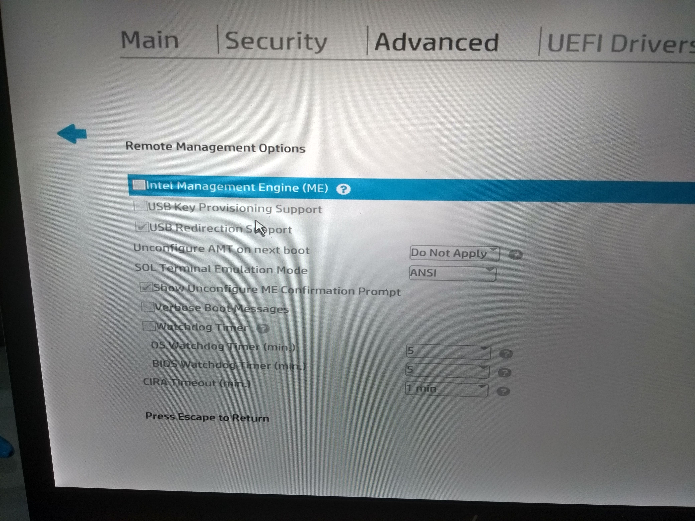
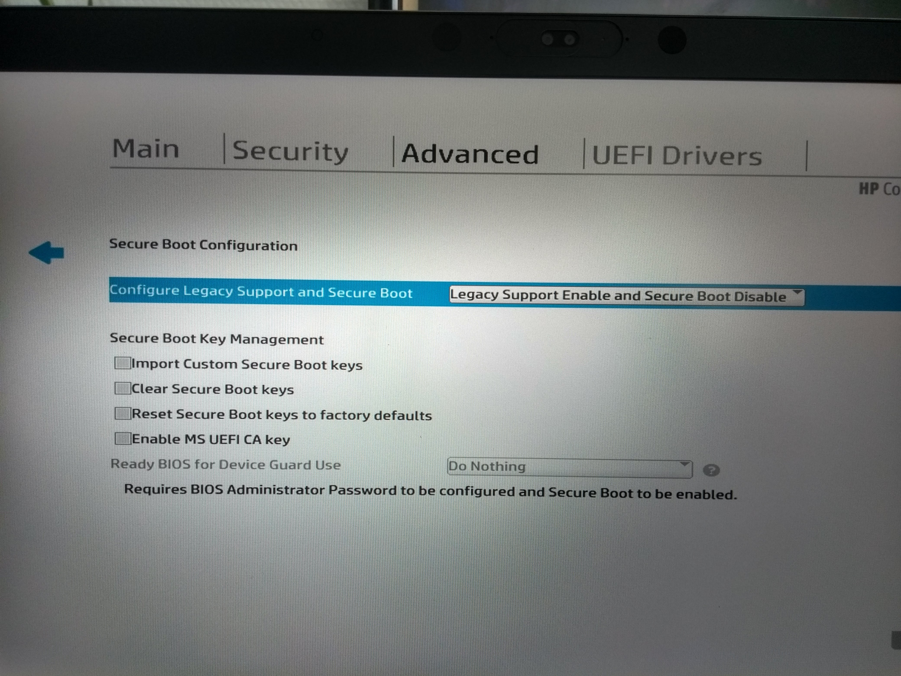
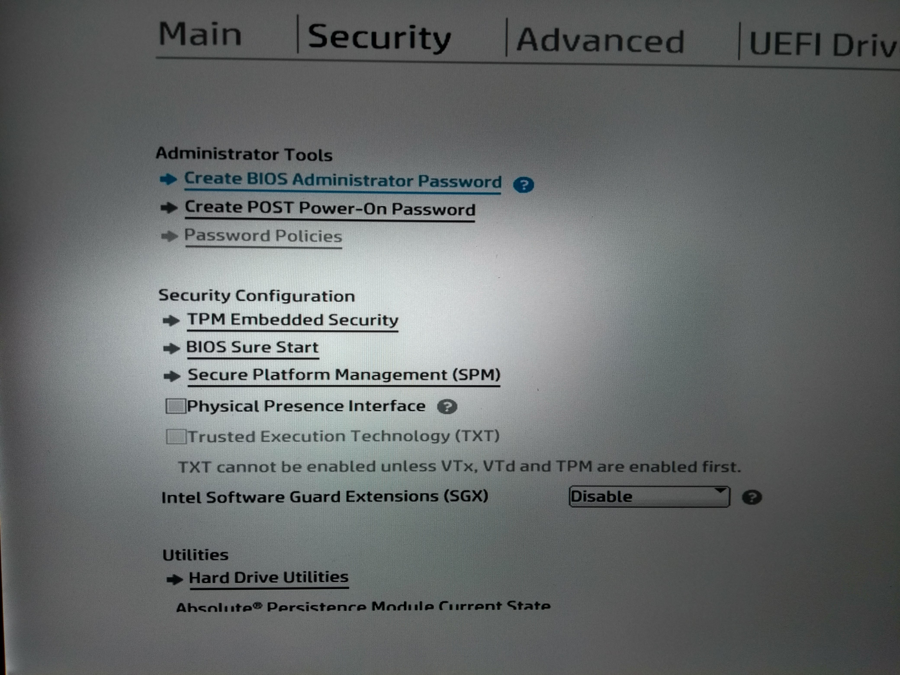
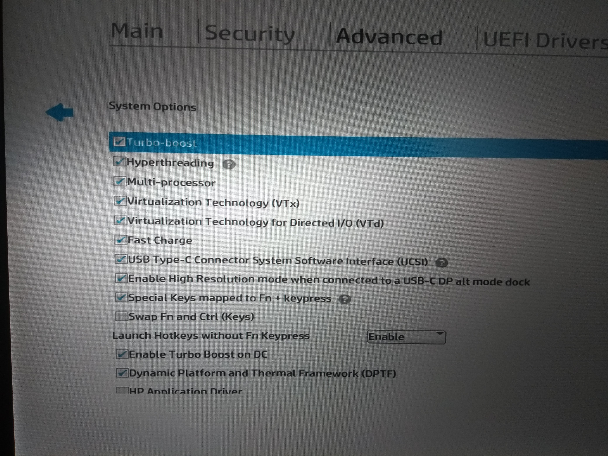

# BIOS Options

**BIOS Version:** Q78 Ver. 01.10.01 March 6th, 2020

If you are using a version older than 01.10.01, be careful if you want to update your BIOS to 01.10.01 or newer. They changed something and you have to add an ACPI Patch in your `config.plist` before the update, otherwise macOS won't boot.

This is already done in my `config.plist` available in this repo as of April 30th, 2020.

